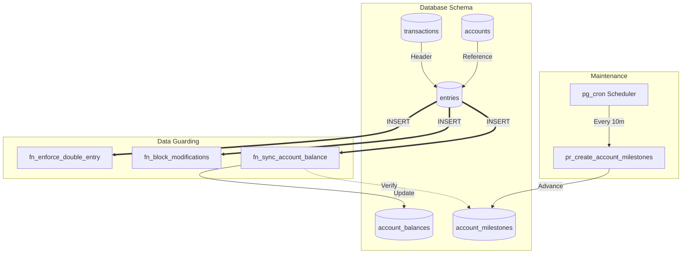

# ⚖️ Ledger-Core: Hardened SQL Accounting Engine

Ledger-Core is a high-performance, immutable double-entry ledger implemented entirely within PostgreSQL 18.

Unlike traditional applications that rely on middle-tier logic (Java/Python) to enforce financial rules, Ledger-Core moves the "Laws of Accounting" into the database schema itself. This ensures that even if a backend service has a bug, the ledger remains balanced, immutable, and audit-ready.

## ✨ Why Ledger-Core?

- **Logic-in-Database**: Financial rules enforced at the database level, not application layer
- **Guaranteed Immutability**: Cryptographic-strength guarantees that records cannot be modified
- **Real-Time Integrity**: Every transaction is verified against ground truth before commit
- **Enterprise-Grade Auditability**: Complete transaction history preserved forever
- **Sub-Millisecond Balance Lookups**: O(1) cached balances with O(N) auditability
- **Distributed-Ready**: UUID v7 support for globally unique, time-ordered IDs


## 🛡️ The Four Pillars of Integrity

### Atomic Double-Entry Balancing: 
A DEFERRABLE constraint trigger ensures that no transaction can be committed unless the sum of Debits equals the sum of Credits.

### Strict Immutability: 
Triggers explicitly block UPDATE and DELETE operations on all financial records. To fix a mistake, you must post a reversing transaction—exactly like a real-world accounting book.

### The Wall of Integrity: 
A real-time balance cache is automatically verified against a "Ground Truth" calculation during every insert. If a discrepancy is detected (e.g., manual data tampering), the transaction is immediately aborted.

### Milestone Snapshots: 
Background jobs powered by pg_cron create periodic "checkpoints," keeping balance calculations O(1) for fast lookups while maintaining O(N) auditability.

## 📊 Real-Time Financial Reporting
The engine includes a presentation layer (V7) that transforms raw ledger data into standard financial statements:
* **Trial Balance View:** Instantly generates a list of all accounts with their net positions.
* **Global Health Monitor:** A sentinel view that calculates total ledger discrepancy—mathematically proving the system is in balance ($0.00 difference).

## 🚀 Getting Started

### Prerequisites

Docker and Docker Compose

PostgreSQL 18+ (Native support for modern UUIDs and Generated Columns)

pg_cron extension (Included in the provided Docker image)

### 1. Spin up the Environment

From the root directory, run:

````
Bash
docker-compose up -d
````

This initializes a PostgreSQL 18 container with pg_cron pre-configured to run on the ledger_db database.

### 2. Apply the Schema

The schema is organized as a series of Flyway-compatible migrations. Run them in order:

````
Bash
# Example using psql


cat db/migration/V*.sql | psql -h localhost -U admin -d ledger_db
````

### 3. Run the Integrity Test Suite

Verify that the engine's "defenses" are active by running the destructive test suite:

````
Bash
psql -h localhost -U admin -d ledger_db -f tests/integrity_suite.sql
````

You should see NOTICE logs confirming that the engine successfully blocked unbalanced entries and unauthorized deletions.

## Ledger Architecture Diagram




## 📂 Project Structure

````
ledger-core/
├── db/
│   └── migration/
│       ├── V1__Initial_Schema.sql          # Core table definitions
│       ├── V2__Integrity_Triggers.sql      # Double-entry validation & immutability
│       ├── V3__Balance_Automation.sql      # Real-time balance sync with integrity checks
│       ├── V4__Audit_And_Repair.sql        # Milestones, audit views, emergency repairs
│       ├── V5__Job_Scheduling.sql          # pg_cron background jobs
│       ├── V6__Seed_Data.sql               # Sample accounts
│       └── V7__Reporting_Views.sql         # Financial statement views
├── tests/
│   └── integrity_suite.sql                 # Destructive test suite
├── docker-compose.yml                       # PostgreSQL 18 + pg_cron setup
└── README.md
````

### UUID v7 Primary Keys

We use UUID v7 for all primary keys. Unlike random UUIDs (v4), v7 is time-ordered. This provides the best of both worlds:

#### Global Uniqueness: 
Safe for distributed systems.

#### B-Tree Efficiency: 
New records are inserted at the end of the index, preventing index fragmentation and significantly speeding up writes.

### Milestone Architecture

To ensure the system scales to millions of entries, we use a snapshot pattern.

1. The Current Balance is stored in a cached table.

2. Every 10 minutes, a Milestone is saved.

3. When a new entry is posted, the system only calculates the "Delta" from the last milestone to verify the cache, ensuring the integrity check never slows down as the ledger grows.

## 📝 License
Distributed under the MIT License. See LICENSE for more information.
